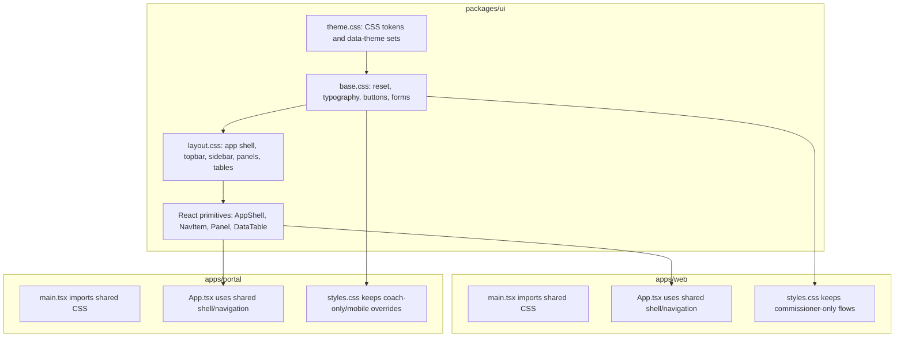

# Shared Theme Refactor Plan

## Direction

Build a custom NCAA-specific shared UI package rather than adopting MUI. The shared layer should live under `[packages/ui](packages/ui)` because the repo already uses npm workspaces for `[packages/*](packages)` and both frontend apps can depend on it.

Use `[.cursor/skills/ncaa-frontend-theming/ncaa-styleguide.html](.cursor/skills/ncaa-frontend-theming/ncaa-styleguide.html)` as the source of truth: Dark Field Retro palette, `Bebas Neue` display text, `IBM Plex Mono` body/UI text, compact topbar/sidebar shell, sharp panels, low-radius controls, teal UI accents, and gold CTAs.

Current blockers to address:

```css
body {
  margin: 0;
  min-width: 1000px;
  /* hardcoded colors */
}

.app-shell {
  display: grid;
  grid-template-columns: 280px 1fr;
}
```

This pattern exists in both `[apps/web/src/styles.css](apps/web/src/styles.css)` and `[apps/portal/src/styles.css](apps/portal/src/styles.css)`, which is why theme and responsive work should start by extracting shared primitives.

## Target Architecture



## Implementation Plan

1. Create `[packages/ui](packages/ui)` with `@ncaa/ui` package metadata, TypeScript config, and style exports.
   - Export `styles/theme.css`, `styles/base.css`, and `styles/layout.css`.
   - Add `:root` and `[data-theme="dark-field-retro"]` CSS variables from the style guide.
   - Keep a clear extension point for future themes through additional `[data-theme="..."]` token blocks.

2. Add lightweight shared React primitives in `@ncaa/ui`.
   - Start with `AppShell`, `ShellTopbar`, `SidebarNav`, `NavItem`, `Panel`, and `DataTable` only.
   - Keep them class-based and composition-friendly so commissioner import pages and portal coach pages can keep their page-specific JSX.
   - Avoid inline theme styles; themeable values should flow through CSS variables.

3. Wire both apps to the shared package.
   - Add `@ncaa/ui` to `[apps/web/package.json](apps/web/package.json)` and `[apps/portal/package.json](apps/portal/package.json)`.
   - Import shared CSS from `[apps/web/src/main.tsx](apps/web/src/main.tsx)` and `[apps/portal/src/main.tsx](apps/portal/src/main.tsx)` before each app’s local stylesheet.
   - Keep `[apps/web/src/App.tsx](apps/web/src/App.tsx)` on `HashRouter` and keep Electron API gating untouched.
   - Keep `[apps/portal/src/App.tsx](apps/portal/src/App.tsx)` on `HashRouter` and preserve auth/data provider boundaries.

4. Refactor the shell in both apps to the shared layout.
   - Move from duplicated 280px sidebar-only layout toward style-guide topbar plus compact sidebar.
   - Commissioner shell should preserve desktop density and Electron constraints from `[apps/desktop/src/main.ts](apps/desktop/src/main.ts)`.
   - Portal shell should be mobile-first below tablet widths: topbar stays visible, nav collapses into a compact horizontal/stacked navigation pattern, and content becomes single column.

5. Split duplicated CSS into shared and app-specific layers.
   - Shared: reset, font variables, buttons, inputs, `.app-shell`, `.sidebar`, `.nav-link`, `.content`, `.panel`, `.grid`, `.table-wrap`, table base styles, notices, pills, and common typography utilities.
   - Commissioner-only: assignment editor, import toolbox, editable OCR rows, season advance, scanner, admin, and commissioner-specific metric/card treatments in `[apps/web/src/styles.css](apps/web/src/styles.css)`.
   - Portal-only: sign-in, coach dashboard cards, roster rows, schedule rows, progression chart, career/archive views, and mobile-specific coach page refinements in `[apps/portal/src/styles.css](apps/portal/src/styles.css)`.

6. Make the hosted portal mobile friendly.
   - Remove the portal’s global `min-width: 1000px` behavior.
   - Add responsive breakpoints for `.grid.two`, `.grid.three`, `.metric-grid`, `.section-header`, `.actions`, `.details`, and coach tables.
   - Keep wide data tables scrollable inside `.table-wrap`, but add mobile-friendly spacing, smaller typography tokens, and card-like row treatments where tables become too dense.
   - Ensure sign-in, dashboard, team roster, progression chart, career, and archive pages work at phone, tablet, and desktop widths.

7. Prepare for future themes without shipping a picker.
   - Set the default document theme with `data-theme="dark-field-retro"` or allow CSS to default to that token set.
   - Keep a tiny utility boundary such as `applyTheme(themeId)` or a typed `ThemeId` export if useful, but do not add UI for choosing themes yet.
   - Document how a future theme adds only a token block plus selective component overrides.

8. Optional cleanup after the shared layer is stable.
   - Split the large portal `[apps/portal/src/App.tsx](apps/portal/src/App.tsx)` into `pages`, `components`, and `lib` folders.
   - Split commissioner `[apps/web/src/commissioner.tsx](apps/web/src/commissioner.tsx)` by route.
   - Keep these as a second wave unless the first implementation becomes too hard to review without them.

## Validation

Run these after implementation:

- `npm run typecheck -w @ncaa/ui`
- `npm run typecheck -w @ncaa/web`
- `npm run typecheck -w @ncaa/portal`
- `npm run build -w @ncaa/web`
- `npm run build -w @ncaa/portal`
- Visual spot-check `npm run dev` for the Electron commissioner renderer and `npm run dev:portal` for the hosted portal.
- Portal responsive spot-checks at roughly 390px, 768px, and desktop widths.

## Risks And Guardrails

- Keep routing on `HashRouter` for both apps.
- Do not move Electron IPC, OCR, storage, or API behavior while refactoring theme/UI.
- Do not introduce inline theme styles.
- Do not over-extract app-specific flows into `@ncaa/ui`; shared components should stay generic enough for both apps.
- Keep team branding data-driven via domain team colors if we add it later, rather than hardcoding team colors into theme CSS.